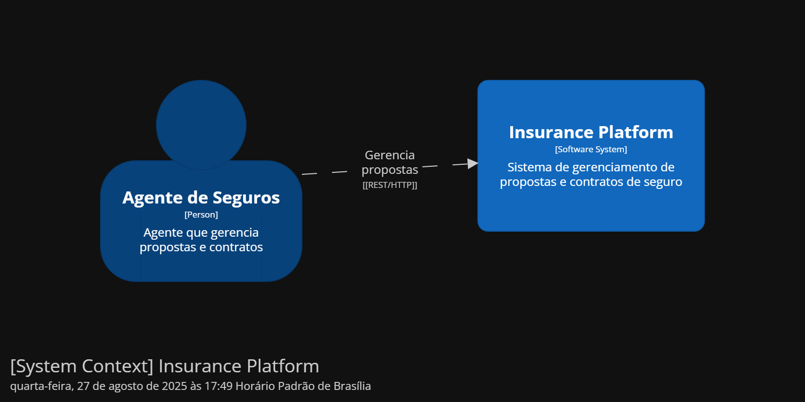
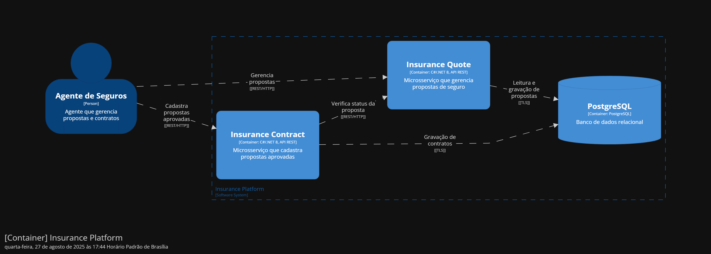

# Insurance Platform

Este projeto foi desenvolvido como solução para o desafio de gerenciamento e atualização de propostas de seguro utilizando microserviços de forma segura e escalável.

---

## 🛠️ Decisões Técnicas e Arquiteturais

### Arquitetura Hexagonal (Ports and Adapters) 
A solução utiliza essa arquitetura para manter o **domínio** protegído e desacoplado de tecnologias externas, facilitando a evolução, manutenção e integração com novos sistemas. Dessa forma, é possível:
-   Manter o domínio independente de tecnologias externas.
-   Facilitar a **manutenção e evolução** sem alterar regras existentes.
-   Ter responsabilidades claras e código organizado.
-   Integrar novas estratégias ou sistemas externos de forma simples, mantendo o core seguro.

### Banco de Dados PostgreSQL
A persistência dos dados é realizada utilizando PostgreSQL garantindo:
- Armazenamento relacional confiável e performático.
- Suporte a transações e integridade.
- Flexibilidade para escalabilidade futura e integração com outros serviços.

### Separação em Microsserviços
O sistema está dividido em dois microsserviços principais:
- **InsuranceQuoteService:** Responsável pelo gerenciamento de propostas de seguros.
- **InsuranceContractService:** Responsável pela criação de contratos de seguro para propostas aprovadas.

---

## 📚 Frameworks e bibliotecas

- **.NET 8 SDK:** Utilizado pela robustez da plataforma, performance, suporte atualizado e experiência no desenvolvimento. 
- **FluentMigrator:** Utilizado para gerenciar migrations do PostgreSQL, garantindo versionamento, histórico de alterações no banco e facilidade de evoluir a estrutura de dados de forma segura e controlada.
- **Dapper:** Micro-ORM utilizado para consultas SQL manuais e eficientes.
- **System.Text.Json:** Utilizado para serialização e deserialização de dados na CLI.
- **xUnit:** Framework de testes unitários escolhido por ser leve, moderno e amplamente utilizado em projetos .NET.  

---

## ▶️ Como compilar e executar o projeto

### Pré-requisitos
- [.NET 8 SDK](https://dotnet.microsoft.com/en-us/download/dotnet/8.0) instalado.
- [Docker](https://www.docker.com/get-started/) instalado e em execução.

### 1. Subir o container do PostgreSQL:
Com o Docker em execução, abra um terminal na raiz do projeto e execute o comando abaixo para subir o container do PostgreSQL. 

```
docker-compose up -d
```

### 2. Iniciar os Microsserviços:
Após subir o container do banco de dados, é necessário iniciar os microsserviços **InsuranceQuoteService** e **InsuranceContractService**. Eles podem ser executados de duas formas:

#### Opção 1: Visual Studio
1. Abra as soluções no Visual Studio.
2. Selecione**InsuranceQuoteService.Presentation** e **InsuranceContractService.Presentation** como projetos de inicialização.
3. Clicar em **Iniciar** ou precssione **F5** para que a interface do swagger se abra no navegador.

#### Opção 2: Terminal:
1. Abra um terminal na raiz do projeto.
2. Execute os microsserviços individualmente:

**Para InsuranceQuoteService:**
```
cd InsuranceQuoteService

dotnet run --project ./InsuranceQuoteService
```
**Para InsuranceContractService:**

```
cd InsuranceContractService

dotnet run --project ./InsuranceContractService
```

Após executar os comandos, abra o link exibido no termino no navegador e acrescer `/swagger` ao final da URL para acessar a UI.

---

## ✅ Como executar os testes

Eles podem ser executados de duas formas:

#### Opção 1: Visual Studio
1. Abra as soluções no Visual Studio.
2. Pressione **CTRL + R, A**.

#### Opção 2: Terminal:
1. Abra um terminal na raiz do projeto.
2. Execute testes dos microsserviços:

**Para InsuranceQuoteService:**
```
cd InsuranceQuoteService

dotnet test
```
**Para InsuranceContractService:**

```
cd InsuranceContractService

dotnet test
```
Abra um terminal na raiz do projeto desejado e execute o comando abaixo para executar todos os testes.

```bash
dotnet test
```

## Modelo C4

Neste projeto foi desenvolvido o **modelo C4** para o desafio, seguindo os níveis: 

- **System Context (Level 1):** Detalha de forma abrangente o contexto.  
- **Container Diagram (Level 2):** Detalha os containers internos, incluindo os microserviços `InsuranceQuote` e `InsuranceContract`, e a comunicação com o banco de dados PostgreSQL.  

O código utilizado para gerar os diagramas foi desenvolvido em **Structurizr DSL** e está disponível no arquivo:  
`docs/doc-c4.txt`

As imagens dos diagramas gerados estão disponíveis na pasta:  
`docs/`

## Diagramas C4

### Nível 1 - System Context


### Nível 2 - Container
